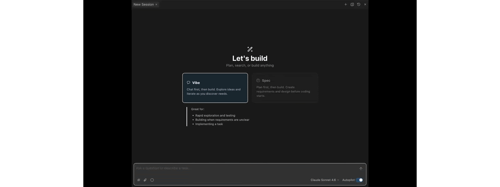

# Keypup MCP Server

[](https://insiders.vscode.dev/redirect/mcp/install?name=keypup&config=%7B%22type%22%3A%20%22http%22%2C%20%22url%22%3A%20%22https%3A//hq.keypup.io/mcp%22%7D)
[](cursor://anysphere.cursor-deeplink/mcp/install?name=keypup&config=eyJ1cmwiOiAiaHR0cHM6Ly9ocS5rZXlwdXAuaW8vbWNwIiwgImF1dGgiOiB7IkNMSUVOVF9JRCI6ICJodHRwczovL2N1cnNvci5jb20ifX0=)
[](https://kiro.dev/launch/mcp/add?name=keypup&config=%7B%22url%22%3A%20%22https%3A//hq.keypup.io/mcp%22%2C%20%22oauth%22%3A%20%7B%22clientId%22%3A%20%22https%3A//kiro.dev%22%2C%20%22redirectUri%22%3A%20%22127.0.0.1%3A57517%22%7D%2C%20%22disabled%22%3A%20false%2C%20%22autoApprove%22%3A%20%5B%5D%7D)

> Ask your Keypup engineering data in plain language to track delivery, quality and team workload.



The Keypup MCP (Model Context Protocol) server plugs your Keypup engineering
analytics directly into any MCP-compatible AI assistant — Claude, Cursor, Kiro,
ChatGPT Desktop, Gemini CLI, VS Code, and others.

Once connected, you ask questions about your engineering activity in plain
language and the AI builds and runs the underlying reporting queries for you.
No query language to learn, no code to write.

Unlike the [GraphQL API](https://docs.keypup.io/en/articles/10260626-using-the-api),
which is designed for developers writing application code, the MCP server is
designed to be driven conversationally by an AI on your behalf.

> **Beta**: The Keypup MCP server is currently in beta. The exposed capabilities
> are continuously expanded during this phase. Feedback and use cases are
> welcome via the in-app chat.

## What it can do

The server exposes a focused set of read-only tools that let an AI explore and
query your Keypup data:

- **Discover your companies** — list the companies (teams) you belong to.
- **Explore datasets** — browse the available datasets and the fields each one exposes.
- **Discover formula operators** — list the functions and operators available when building metrics, dimensions, and filters.
- **Run reporting queries** — execute aggregated queries against any dataset, with metrics, dimensions (group-by), filters, sorting, and pagination.
- **Generate a query from natural language** — turn a plain-language request into a ready-to-run structured query that the AI can then execute.

The AI orchestrates these tools automatically. A typical flow:

1. List your companies
2. Pick the relevant dataset
3. Look up the fields it needs
4. Build the query
5. Run it
6. Summarize the results

You only ask the question.

## Tools

| Tool | Description |
| --- | --- |
| `list_companies` | List the companies (teams) the authenticated user belongs to. Returns each company's `id`, `name`, `created_at` and `updated_at`. The `id` is required by most other tools. |
| `list_datasets` | List the datasets (facts) available for querying, each with its `id`, `label` and `description`. |
| `list_dataset_fields` | List the fields available on a given dataset for a company. Supports filtering by `source` (`NATIVE`/`CUSTOM`) and a regex `pattern` matched against the field id, plus pagination. |
| `list_formula_operators` | List the operators and functions usable in custom formulas. Supports filtering by `scope` (`DIMENSION`/`METRIC`) and a regex `pattern`, plus pagination. Set `verbose: true` for full per-operator documentation. |
| `query_dataset` | Run an aggregated report against a dataset. Metrics, dimensions and filters are expressed as text-based formulas, with optional sorting, `limit` and `offset`. |
| `generate_dataset_query` | Turn a natural-language `prompt` into a structured query compatible with `query_dataset`. |

### Datasets

The reporting engine runs over the following datasets (facts):

- **`ISSUES_PULL_REQUESTS`** — issues and pull requests.
- **`ACTIVITY_EVENTS`** — transitions on issues/PRs (status changes, assignments, work logged, open/close/reopen).
- **`COMMENTS`** — comments on issues, PRs and reviews.
- **`COMMITS`** — commits attached to pull requests.
- **`REVIEWS`** — pull request reviews.

## Example questions

**Delivery & throughput**
- "How many pull requests did we merge each month over the last 6 months?"
- "What's our weekly issue closing rate this quarter?"
- "How many commits were made per author last month?"

**Cycle time & performance**
- "What's the average time between PR creation and merge over the last 12 weeks?"
- "Show me the review turnaround time trend for the last 3 months."
- "Which repositories have the slowest cycle time?"

**Quality & process**
- "How many bugs were raised vs. closed each week this quarter?"
- "What proportion of our pull requests resolve at least one issue?"
- "How many PRs were merged without a review?"

**Workload & collaboration**
- "Who are our most active reviewers this month?"
- "How is work distributed across the team right now?"
- "How many comments do our pull requests receive on average?"

**Open-ended exploration**
- "Summarize our engineering activity over the last month."
- "Compare open vs. closed issues over time."
- "What labels are most common on our issues?"

You can refine iteratively: "now break that down by repository", "restrict it to
the backend team", and so on.

## Setup

### Endpoint

```
https://hq.keypup.io/mcp
```

The server uses the streamable HTTP transport and supports two authentication
methods:

1. **OAuth 2.1 (recommended)** — the client registers itself dynamically and you
   authorize access through your browser. No token to copy or store.
2. **API token** — a Keypup API token passed in the `Authorization` header. Use
   this when your client does not support OAuth dynamic client registration.

### Option 1 — OAuth (recommended)

If your client supports OAuth 2.1 with dynamic client registration (e.g. via a
Client ID Metadata Document), point it at the endpoint with no credentials:

```json
{
  "mcpServers": {
    "keypup": {
      "type": "http",
      "url": "https://hq.keypup.io/mcp"
    }
  }
}
```

On first connection the client opens a browser window to sign in to Keypup and
authorize access. There is no token to generate, copy, or rotate — this is the
configuration shipped in this repo's [`.mcp.json`](./.mcp.json).

> If your client does not open an authorization prompt (or fails to register),
> it likely does not support dynamic client registration yet. Use the API token
> method below instead.

### Option 2 — API token

For clients without OAuth dynamic client registration support, add a `keypup`
server entry pointing at the endpoint, with your API token in the `Authorization`
header:

```json
{
  "mcpServers": {
    "keypup": {
      "url": "https://hq.keypup.io/mcp",
      "headers": {
        "Authorization": "Bearer my_keypup_api_token"
      }
    }
  }
}
```

Notes:

- Replace `my_keypup_api_token` with the token you generate (see below). Keep the `Bearer ` prefix.
- The server name (`keypup`) is arbitrary — name it however you like.

Once saved, restart or reconnect the MCP server in your client. The Keypup tools
should appear in the client's tool list, and you can start asking questions.

## Generating an API token

> Only needed for **Option 2 (API token)**. If you authenticate via OAuth, skip
> this section.

The MCP server authenticates with the same API tokens used by the GraphQL API.

1. Go to **Settings → Account** and open the **API Token** tab.
2. Click **Create token**.
3. Set a descriptive name (e.g., "MCP - Claude Desktop") and an expiration. Setting an expiration is strongly recommended.
4. Select the token scopes. The minimal recommended scopes for the MCP server are:
   - **Reports read** (`viz:reports:read`) — required to explore datasets/fields and run reporting queries.
   - **Companies read** (`hq:companies:read`) — required to list the companies you belong to and resolve the company ID used in queries.
5. Click **Create**. The token is shown only once and can be copied for one minute — copy it into your MCP client configuration right away.

Following the principle of least privilege, grant only the scopes you need. The
two scopes above are enough to use the full analytics capabilities of the MCP
server.

The token grants the same level of data access you already have in the Keypup
user interface — queries are automatically scoped to the companies you are a
member of.

## Security

- All Keypup MCP tools are **read-only** — they never modify your data.
- Queries are automatically scoped to the companies you belong to (data isolation).
- Treat your API token like a password. Anyone holding it can query your Keypup data within the granted scopes.
- Prefer short-lived tokens with an expiration, and rotate them periodically.
- Keep tokens out of shared or version-controlled files. Store them in your MCP client's local configuration only.

## Resources

- [Using the MCP server (documentation)](https://docs.keypup.io/en/articles/15360547-using-the-mcp-server)
- [MCP server product page](https://www.keypup.io/mcp-server)
- [Using the API](https://docs.keypup.io/en/articles/10260626-using-the-api)
- [Security FAQ](https://docs.keypup.io/en/articles/8108804-security-faq)
